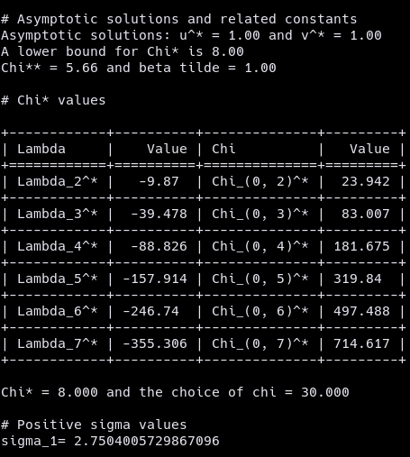
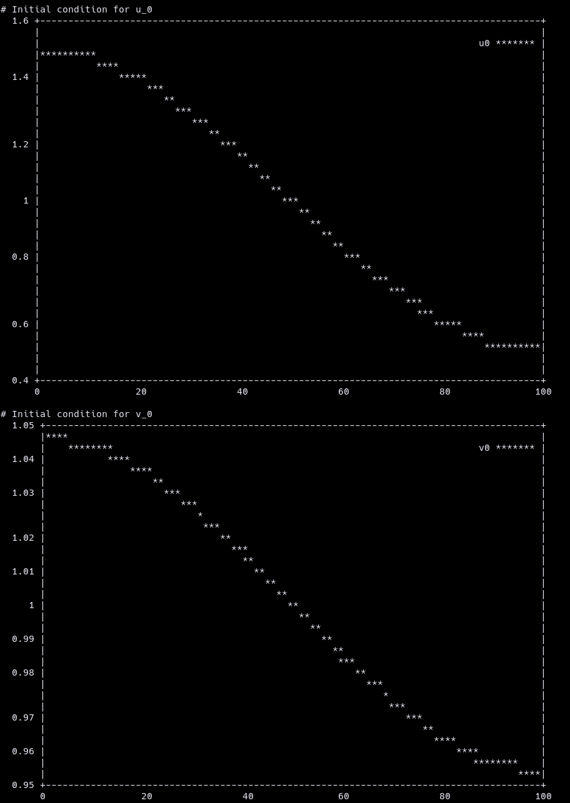
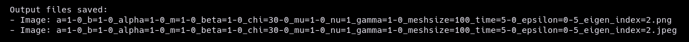
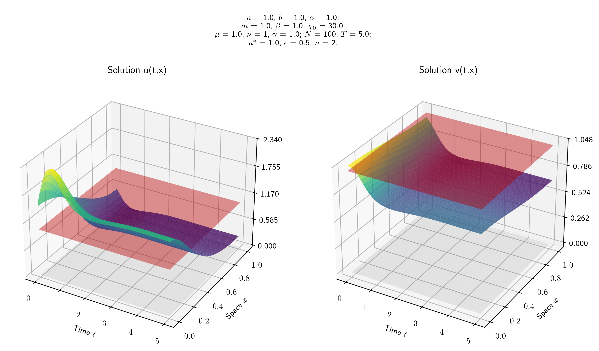
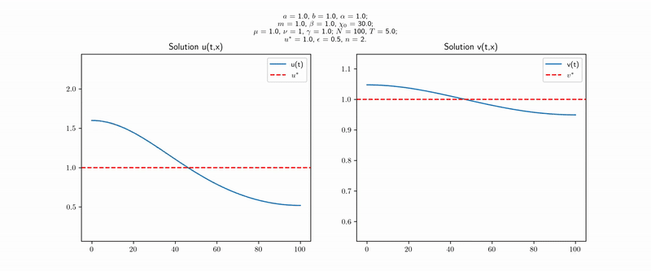

# Chemotaxis Simulations CLI Tool

[](https://pypi.org/project/chemotaxis-sim/)
[](https://pypi.org/project/chemotaxis-sim/)
[](LICENSE)

A command-line interface (CLI) tool to simulate chemotaxis processes based on a parabolic-elliptic PDE model.

## Table of Contents

- [About](#about)
- [Installation](#installation)
- [Usage](#usage)
- [Features](#features)
- [Documentation](#documentation)
- [Contributing](#contributing)
- [License](#license)
- [Contact](#contact)

## About

This repository contains a program that simulates a chemotaxis process from a parabolic-elliptic system of partial differential equations. It is based on the research paper *Global Existence and Asymptotic Behaviour of Classical Solutions of Chemotaxis Models with Signal-dependent Sensitivity and Logistic Source* by Dr. Wenxian Shen, Dr. Le Chen, and their PhD student Ian Ruau. Here is a link to the research paper **[link to paper]**

Simulations for special sets of parameters are consistent with proven theoretical results. The advantage of this package is that it helps us get insights about behaviours outside of the sets of parameters considered in the research paper.

## Installation

To get started with these simulations, you can install the package using pip:

```bash
pip install chemotaxis-sim
```

## Features

- Run chemotaxis simulations with customizable parameters.
- Terminal plots of initial conditions via termplotlib.
- 3D static surface plots (PNG/JPEG) and optional MP4 animations.
- Progress bar and verbose logging.
- Easy CLI usage with help prompts.

## Usage

Once the package is installed, the user can access the help prompt by simply
running the following command

```bash
chemotaxis-sim --help
```

Here is an example of a simulation

```bash
chemotaxis-sim --chi 30 --meshsize 100 --time 5 --eigen_index 2 --epsilon 0.5 --generate_video yes
```

Saved data controls (optional):

```bash
chemotaxis-sim --save_data yes --save_max_frames 2000 --save_summary6 yes
```

Notes:
- `--save_max_frames` controls the maximum number of time snapshots kept for outputs (plots/summary/video) and written to the saved `.npz` (default: `2000`).
- When using `--until_converged yes`, the in-run snapshot cap is instead `--max_saved_frames` (default: `2000`).

Batch-run output control (optional):

```bash
# Keep only the 6-frame summary images (*_summary6.{png,jpeg}) and any saved data
chemotaxis-sim --save_static_plots no --save_summary6 yes
```

Post-processing heavy plots from saved data:

```bash
# Later, regenerate the main 3D plots (<basename>.png/.jpeg) from the saved .npz
chemotaxis-plot images/branch_capture/some_run.npz
```

Implied constants / bifurcation diagnostics:

```bash
# Global threshold (Eq. (1.12)) + equilibrium (Eq. (1.8))
chemotaxis-constants threshold --config config.example.yaml

# `--config` can be passed before or after the subcommand
chemotaxis-constants --config config.example.yaml threshold

# Bifurcation coefficients (defaults to n0 = argmin mode from the chi_a^* scan)
chemotaxis-constants bifurcation --config config.example.yaml

# Override the mode if desired
chemotaxis-constants bifurcation --config config.example.yaml --n0 1

# Full report + consistency check (is n0 the argmin mode for chi_a^*?)
chemotaxis-constants report --config config.example.yaml --format json

# Sensitivity shift c is supported (defaults to c=1)
chemotaxis-constants report --config config.example.yaml --c 1
```

Why override `--n0`?
- Multi-mode diagnostics: compare higher modes even if `n_min` destabilizes first.
- Near-degenerate minima: inspect competing modes when `chi^*(n)` is very close for multiple `n`.
- Reproducibility: match tables/figures that report coefficients at a fixed mode (often `n0=1`).
- Sensitivity studies: track how the cubic coefficient `beta_{n0}` varies with `n0`.
- Domain effects: compare the same `n0` across changes in `L` even when the argmin mode shifts.

Output naming controls (optional):

```bash
chemotaxis-sim --output_dir images/branch_capture --basename run_beta0_chi2185_epsP
```

### YAML config files
For long parameter lists, you can load defaults from a YAML file via `--config`.
CLI flags always override YAML values, and any missing parameter falls back to
the CLI default.

Example:

```bash
chemotaxis-sim --config config.example.yaml
chemotaxis-sim --config config.example.yaml --chi 2.185 --meshsize 100
```

See `config.example.yaml` for a grouped template.

### Paper II constants (Eq. (1.8) and Eq. (1.12))
The module `paper2_constants.py` computes the equilibrium and the discrete
threshold \(\chi_a^*(u^*)\) from Paper II:

```bash
python paper2_constants.py --a 10 --b 1 --alpha 1 --mu 1 --nu 1 --gamma 1 --m 1 --beta 0 --L 1
```

Load parameters from a YAML file (same key names as the simulator; missing keys
fall back to defaults; CLI overrides YAML):

```bash
python paper2_constants.py --config config.example.yaml
python paper2_constants.py --config config.example.yaml --beta 0 --L 1
```

Or import it in Python:

```python
from paper2_constants import paper2_eq112_constants

c = paper2_eq112_constants(a=10, b=1, alpha=1, mu=1, nu=1, gamma=1, m=1, beta=0)
print(c.u_star, c.v_star, c.chi_a_star)
```

### Stopping automatically when converged
If you do not want to guess a sufficiently large final time, you can run with
`--until_converged yes`.
In this mode, `--time` is interpreted as a *maximum* time horizon and the solver
will stop early once the solution changes by at most `--convergence_tol` over a
time window of length `--convergence_window_time` (after an initial
`--convergence_min_time` warm-up).

Example:

```bash
chemotaxis-sim --chi 2.19 --meshsize 50 --time 200 --eigen_index 2 --epsilon 0.001 --until_converged yes
```

The command above will show first some characteristic constants of the system of
partial differential equations that depend on the parameters input by the user:



A terminal plot of the initial functions u(0,x) and v(0,x) is also shown on the
terminal:



Once the simulation is complete, a picture of the results is saved in both .png
and .jpeg formats (disable with `--save_static_plots no`):





In addition, the numerical data are saved for later post-processing in a
compressed NumPy file:

- `a=..._b=..._c=..._alpha=..._m=..._beta=..._chi=..._mu=..._nu=..._gamma=..._meshsize=..._time=..._epsilon=..._epsilon2=..._eigen_index=....npz`

This `.npz` contains (downsampled) `x_values`, `t_values`, `u_num`, `v_num`,
plus a JSON-encoded copy of the run configuration and some metadata.

The CLI also writes a quick diagnostic figure with 6 time slices of $u(x,t)$
(0%, 20%, …, 100%). The title shows $\chi_0$ and the critical threshold
$\chi^*(u^*)$:

- `..._summary6.png` and `..._summary6.jpeg`

If the user chose to save the animation of the chemotaxis process, an .mp4 video
will be saved as well:



## Documentation

For detailed information about the package and its functionalities, visit the [documentation webpage](https://chemotaxis-simulation.readthedocs.io/en/latest/).

## TODO (performance / workflow)

- Expose an explicit time-step/CFL knob (current `Nt ~ O(T N^2)` can be expensive for `T=100`).
- Add a pure-Python (optional Numba) tridiagonal solver for `solve_v` as a non-SciPy fallback / speed path.
- Generate heavy 3D surface plots from saved `.npz` in post-processing for large batch runs.
- Add a lightweight smoke-test script (short run + basic invariants) since there is no dedicated test suite yet.

## Reproducing previous results

In the following page, we reproduce the results of the research paper by ....

[Reproducing_Results](./Reproducing_Previous_Results/README.md)


## Contributing

Contributions are welcome! Please follow these steps:

1. Fork the repository.
2. Create a new branch (`git checkout -b feature/my-feature`).
3. Commit your changes (`git commit -am 'Add my feature'`).
4. Push to the branch (`git push origin feature/my-feature`).
5. Open a pull request.

## License

This project is licensed under the MIT License – see the [LICENSE](LICENSE) file for details.

## Contact

For any queries or further discussion, feel free to contact us at

- Le Chen: [chenle02@gmail.com] or [le.chen@auburn.edu] or [Homepage](https://webhome.auburn.edu/~lzc0090/index.html).
- Ian Ruau: [ian.ruau@auburn.edu].
